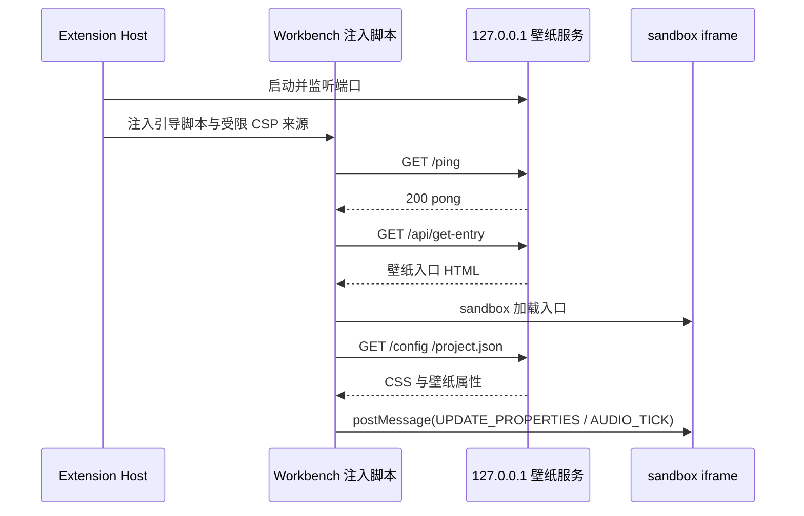

# VS Code Wallpaper Engine 通信机制

本文档描述扩展宿主、Workbench 注入脚本、本地壁纸服务和沙箱壁纸页面之间的边界与消息流。代码实现以 `src/extension.ts`、`src/core/injector.ts`、`src/core/server.ts` 和 `src/panels/setting-panel.ts` 为准。

## 1. 组件与安全边界

系统由四个部分组成：

1. **Extension Host**：运行扩展宿主中的 Node.js 代码，负责生命周期、配置、透明化规则、本地服务器和 Workbench 文件修改。
2. **Workbench 注入脚本**：运行在 VS Code 主窗口，用于创建壁纸容器、同步透明化 CSS 和向壁纸 iframe 发送运行时消息。
3. **本地壁纸服务器**：由 Extension Host 启动，默认只监听 `127.0.0.1:23333`，提供壁纸入口、项目配置和健康检查接口。
4. **壁纸 iframe**：使用 `sandbox="allow-scripts"` 加载 Web 壁纸入口。未授予 `allow-same-origin`，因此壁纸脚本不能读取或修改 Workbench DOM，也不能直接访问扩展宿主。

Workbench 原有 Content-Security-Policy 会被保留。注入只向 `frame-src` 和 `connect-src` 增加当前端口的 `http://127.0.0.1:<port>`，不会恢复旧版的全开放 CSP。注入代码带有协议版本标记，升级或还原时可识别并清理旧注入。

## 2. 初始化与壁纸加载

1. 扩展激活后读取配置，并按需要启动本地服务器。
2. 设置壁纸命令扫描创意工坊目录中的 `project.json`。当前支持 `video`、`image` 和 `web`，原生 `scene` 类型会被诊断为不支持，不会作为可加载壁纸返回。
3. 服务器启动后，扩展依次验证媒体、服务健康状态和 `/api/get-entry` 入口。
4. 扩展补丁 Workbench HTML 的 CSP，再把引导代码注入 `workbench.desktop.main.js`，最后请求窗口重载。
5. 注入脚本创建 `#vscode-wallpaper-container` 和壁纸 iframe。Web 壁纸先显示加载状态，iframe `load` 事件触发后再显示内容。
6. 视频和图片壁纸通过 VS Code 资源 URL 加载；Web 壁纸通过本地服务的 `/api/get-entry` 加载。

## 3. 本地 HTTP 接口

所有接口只用于本机 Workbench 与壁纸运行时通信。服务绑定回环地址；响应按接口需要设置 CORS，不能据此把服务视为可供局域网访问的通用文件服务器。

| 接口 | 用途 |
| --- | --- |
| `GET /ping` | 健康检查。普通请求返回 `200 pong`；切换壁纸时可返回一次 `205`，通知客户端重新加载 iframe。 |
| `GET /status` | 返回服务是否运行、当前壁纸根目录和入口文件，用于端口复用检查。 |
| `GET /config` | 返回当前 CSS 配置（例如 `customCss`、`themeCompatibility`），供注入脚本同步样式。 |
| `GET /api/get-entry` | 返回视频、图片或 Web 壁纸的可加载入口 HTML。 |
| `GET /project.json` | 合并当前壁纸及依赖目录的项目属性，供壁纸属性面板使用。 |
| `GET /proxy?url=...` | 为壁纸兼容层代理公开网络资源。只接受 `http`/`https`，拒绝私网或回环地址、DNS 解析到私网的目标和重定向；单请求超时 10 秒，响应上限 10 MiB。 |
| `GET /shutdown` | 本地服务接管时使用的关闭信号，不应由壁纸页面主动调用。 |

文件请求会经过真实路径校验，只允许落在当前壁纸目录或已解析的依赖目录内；路径穿越、符号链接越界和目录外文件不会被返回。

## 4. Workbench 与壁纸 iframe 消息

注入脚本会向 iframe 发送以下运行时消息。由于 `sandbox` iframe 使用 opaque origin，消息目标使用 `*`；消息只发送到扩展创建并持有引用的 iframe。

```ts
{ type: 'UPDATE_PROPERTIES', data: { [key]: { value } } }
{ type: 'PROPERTIES', data: { [key]: { value } } }
{ type: 'AUDIO_TICK', data: { ...audioState } }
```

壁纸兼容层通过 `window.parent.postMessage` 回传音频源等请求；注入脚本只处理预定义消息类型，不把任意消息拼接进 Workbench 主脚本。

## 5. 设置面板消息

Wallpaper Settings 是独立 Webview。打开后先发送 `{ command: "ready" }`，Extension Host 返回当前状态：

- `{ type: "setupState", state }`：设置阶段、运行状态、成功或错误信息。
- `{ type: "compatibilityStatus", state }`：C/C++ Theme 兼容模式、是否启用、命中原因和主题名称。
- `{ type: "language", language, resolvedLanguage }`：配置值和 `auto` 解析后的界面语言。

用户切换语言时发送：

```ts
{ command: 'setLanguage', language: 'auto' | 'zh-CN' | 'en-US' }
```

Host 会校验枚举值并写入用户级设置。透明化规则、开关和基底颜色则按当前资源作用域（工作区文件夹 > 工作区 > 用户）保存，并在写入后把后端确认值回传给面板。

## 6. 刷新、重载与还原

- 修改壁纸或服务器端口时，扩展会保存待确认事务，并在注入完成后请求 `workbench.action.reloadWindow`。
- 重载后的激活流程会验证注入标记、服务健康和壁纸入口；任一项失败都会保留错误状态，便于重试或查看 `Wallpaper Engine` Output 日志。
- 执行“还原壁纸修改”时，扩展会停止服务、移除 Workbench 注入、恢复 CSP、删除插件托管的透明化备份和持久化状态，再通过重载后的验证确认清理完成。
- VS Code 更新可能覆盖 Workbench 文件。此时需要重新执行“设置壁纸”；若不再使用扩展，应先执行还原命令并等待验证通过，再卸载扩展。

## 7. 常见连接问题

1. **服务未启动或端口冲突**：查看 `Wallpaper Engine` Output 中的 `/status` 和监听错误，修改 `serverPort` 后重新设置壁纸。
2. **CSP 或注入标记缺失**：VS Code 更新后核心文件可能恢复原状，重新执行设置壁纸即可重新补丁。
3. **启动瞬间可见、随后变黑**：检查 `ms-vscode.cpptools-themes` 的 Visual Studio C/C++ 主题，保持 `themeCompatibility=auto`，必要时临时设为 `on` 并重载窗口。
4. **属性面板无内容**：确认当前壁纸包含可解析的 `project.json`，并检查本地服务是否能访问 `/project.json`。

## 8. 时序图


